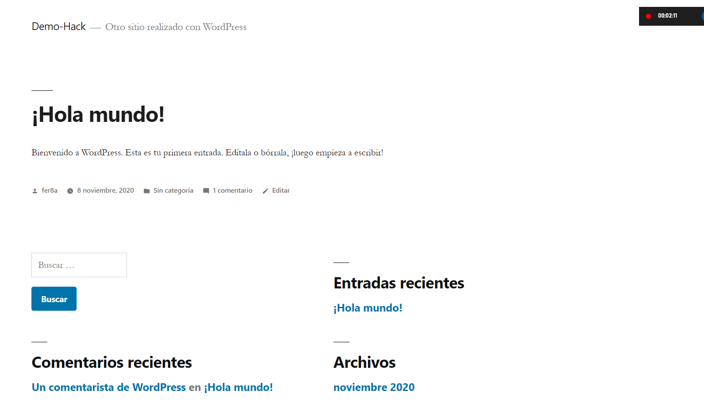

# Nombre del Proyecto

## Descripción del proyetco

## Que hace el proyecto

## Cómo funciona el proyecto (Tecnologías utilizadas)

## Cómo lo hace 

## Retos a los que nos enfrentamos

## Que aprendimos

## Que sigue

## Integrantes (Correo)
